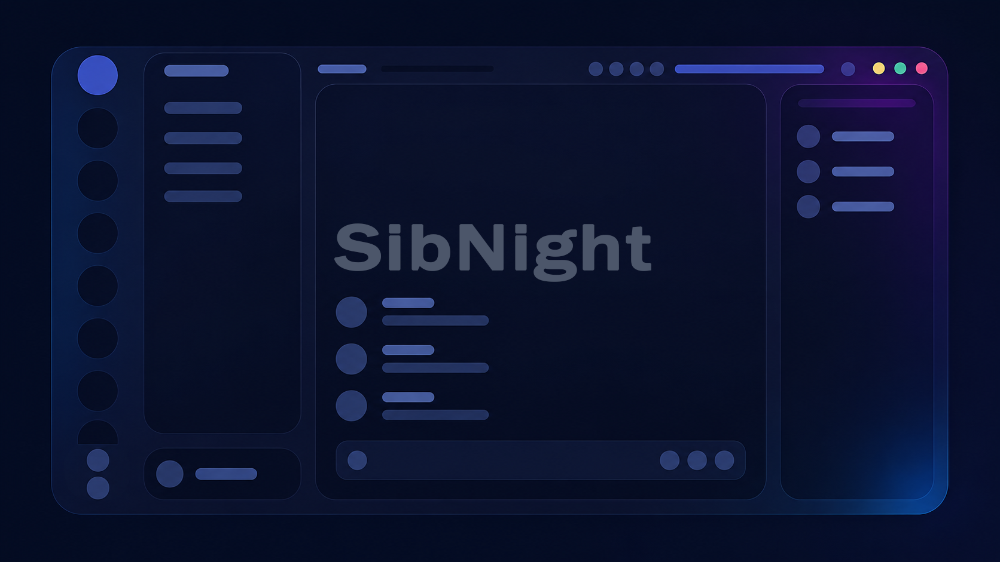
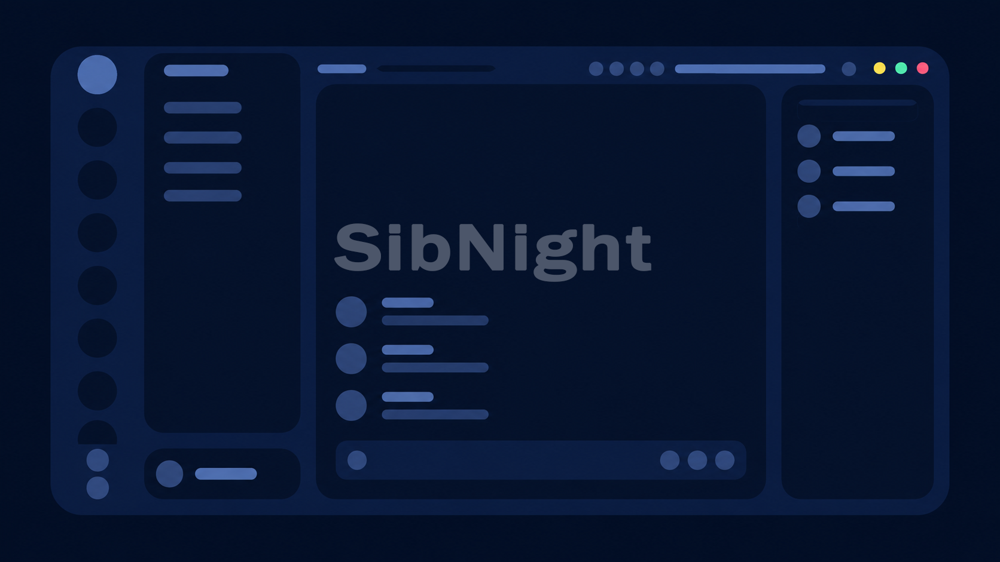
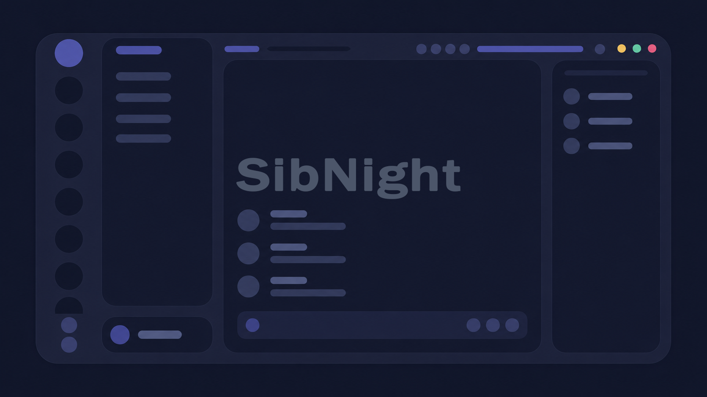
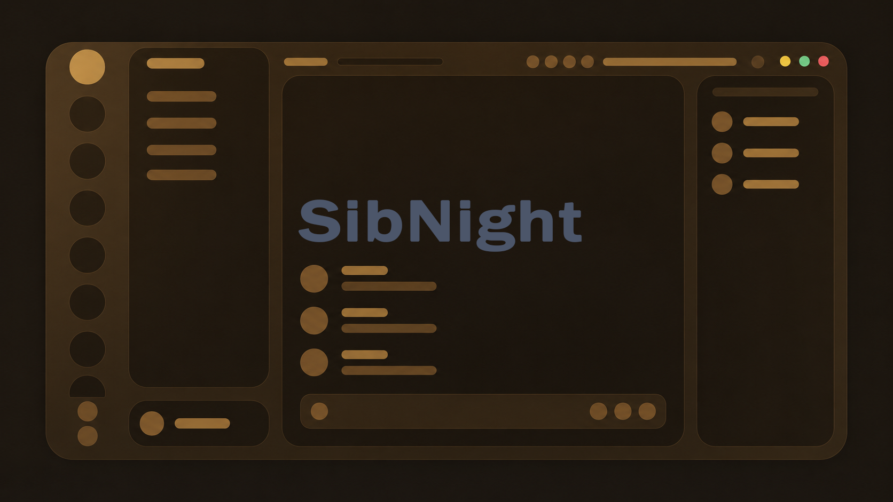
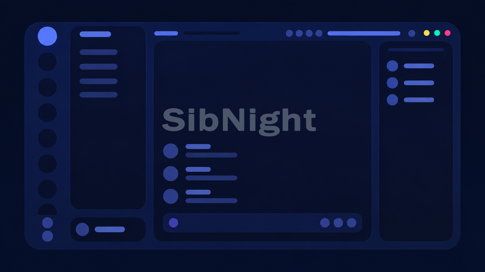
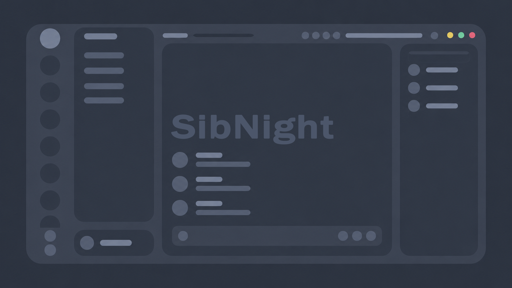
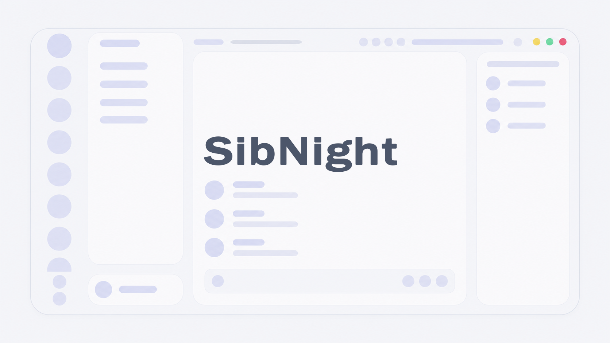
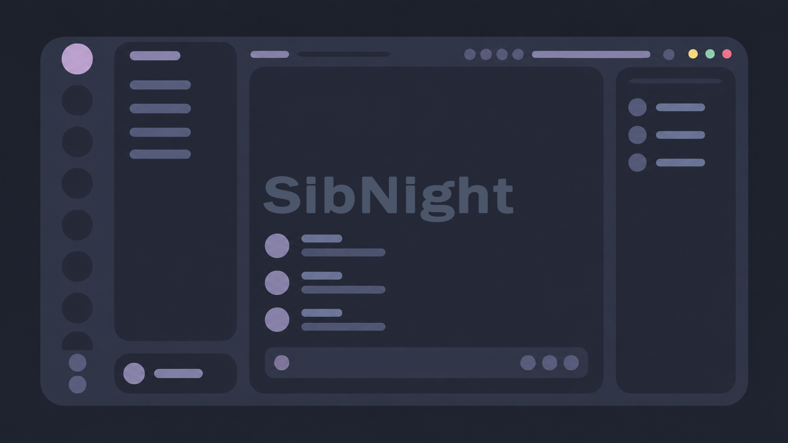
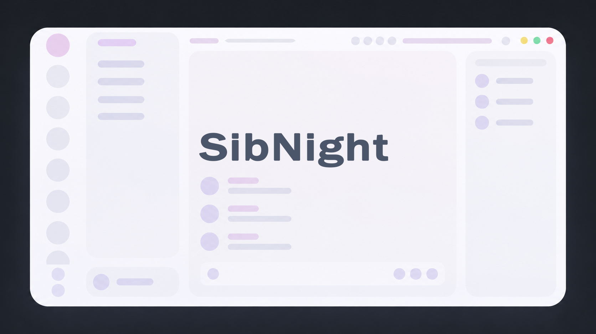

  

<h1 align="center">sibnight</h1>

  Un thème Discord sombre inspiré par l'identité visuelle de Sibylla.

  

## install

### vencord / betterdiscord (ou tout autre client qui prend en charge les fichiers de thème)

1. Télécharge le fichier de thème `sibnight.theme.css`.  
   *(il devrait y avoir un bouton de téléchargement en haut à droite de la page)*
2. Glisse le fichier dans ton dossier de thèmes.  
   *(il devrait y avoir un bouton pour ouvrir le dossier des thèmes dans les paramètres des thèmes)*

## flavors

Les flavors sont des personnalisations prédéfinies pour **sibnight**.

Pour utiliser une flavor, suis les instructions d'installation ci-dessus, mais télécharge le fichier de thème flavor de ton choix à la place de `sibnight.theme.css`.

<table>
  <tr>
    <td width="50%" align="center" valign="top">
      
       
      <strong>sibnight-flat</strong>
       
      <code>themes/flavors/sibnight-flat.theme.css</code>
    </td>
    <td width="50%" align="center" valign="top">
      
       
      <strong>sibnight-tokyo-night</strong>
       
      <code>themes/flavors/sibnight-tokyo-night.theme.css</code>
    </td>
  </tr>
  <tr>
    <td width="50%" align="center" valign="top">
      
       
      <strong>sibnight-sun</strong>
       
      <code>themes/flavors/sibnight-sun.theme.css</code>
    </td>
    <td width="50%" align="center" valign="top">
      
       
      <strong>sibnight-space</strong>
       
      <code>themes/flavors/sibnight-space.theme.css</code>
    </td>
  </tr>
  <tr>
    <td width="50%" align="center" valign="top">
      
       
      <strong>sibnight-north-Polar</strong>
       
      <code>themes/flavors/sibnight-north-Polar.theme.css</code>
    </td>
    <td width="50%" align="center" valign="top">
      
       
      <strong>sibnight-north-Snow</strong>
       
      <code>themes/flavors/sibnight-north-Snow.theme.css</code>
    </td>
  </tr>
  <tr>
    <td width="50%" align="center" valign="top">
      
       
      <strong>sibnight-north-Aurora-Dark</strong>
       
      <code>themes/flavors/sibnight-north-Aurora-Dark.theme.css</code>
    </td>
    <td width="50%" align="center" valign="top">
      
       
      <strong>sibnight-north-Aurora-Light</strong>
       
      <code>themes/flavors/sibnight-north-Aurora-Light.theme.css</code>
    </td>
  </tr>
</table>

## crédits

- original design inspired by https://github.com/schnensch0/zelk
- theme design inspired by https://github.com/refact0r/midnight-discord
- window controls inspired by https://github.com/Dyzean/Tokyo-Night
