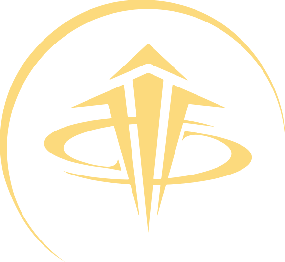
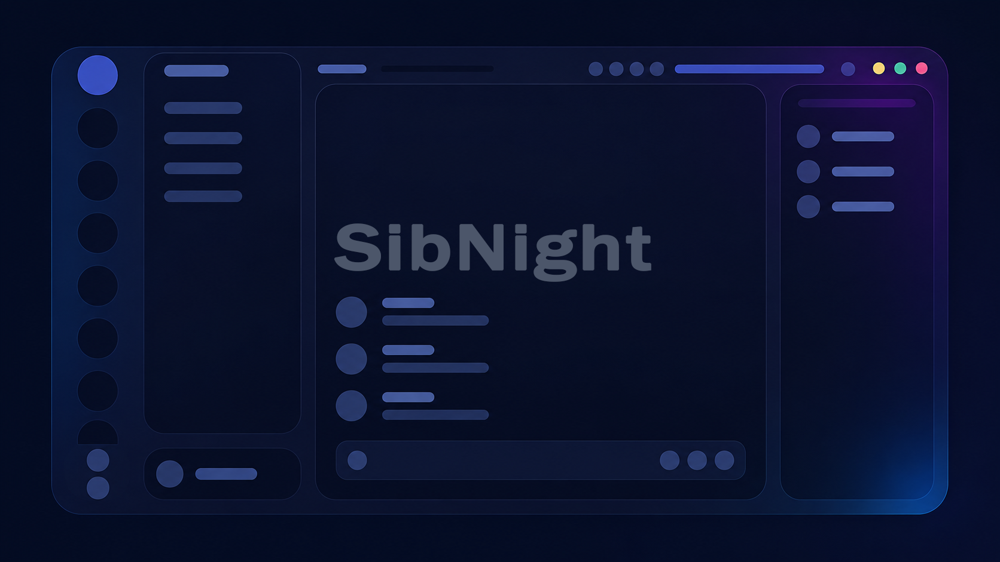
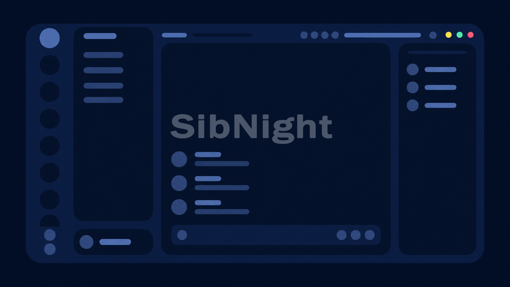
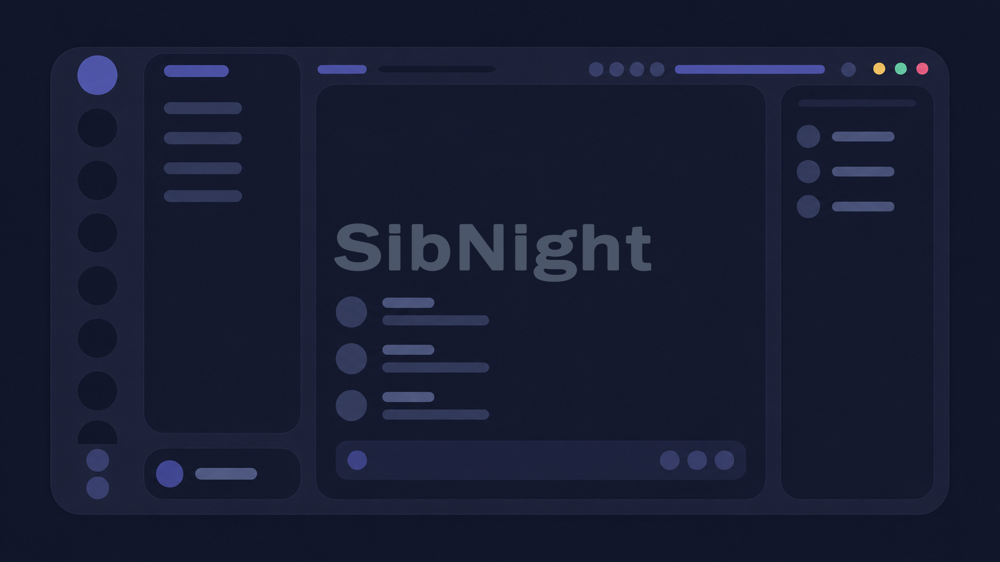
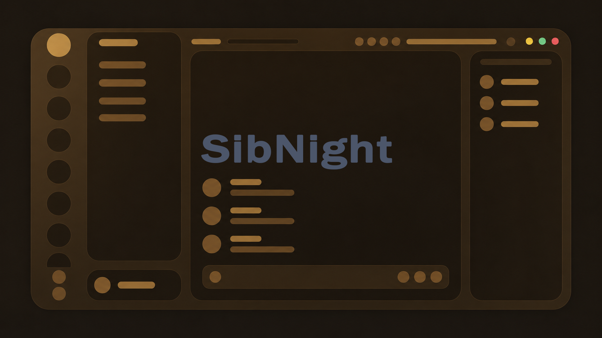
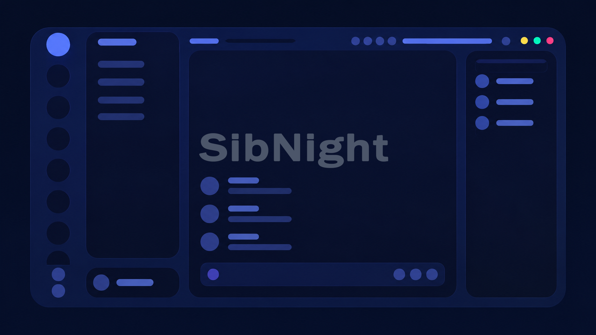
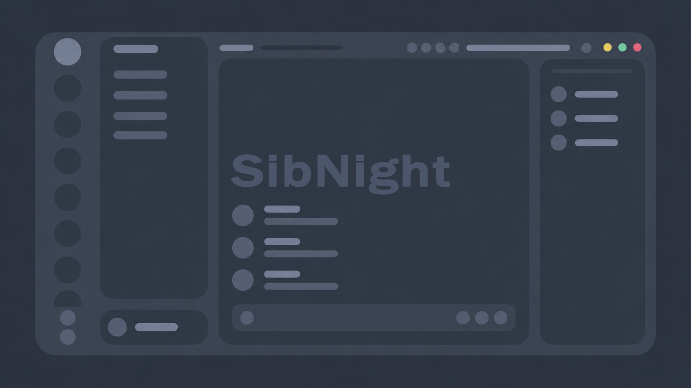
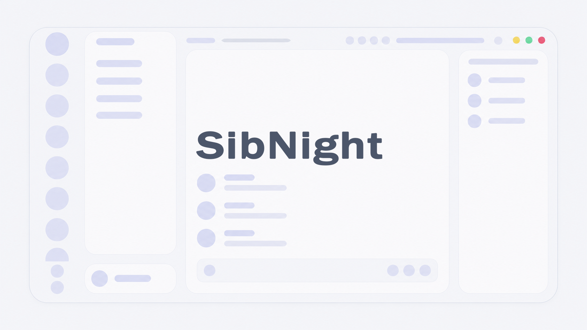
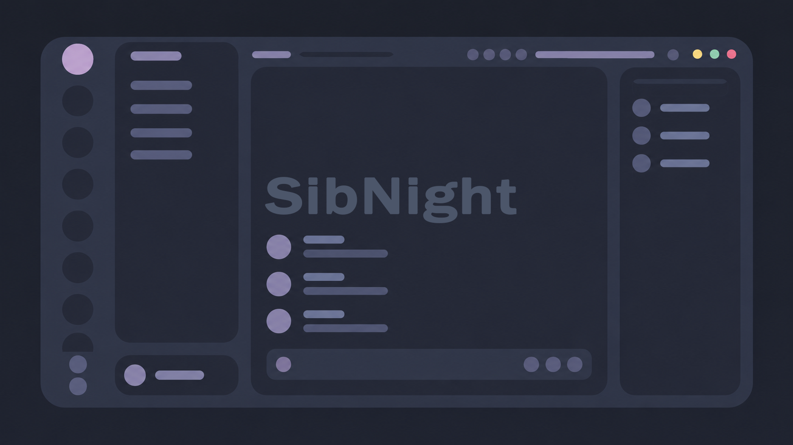
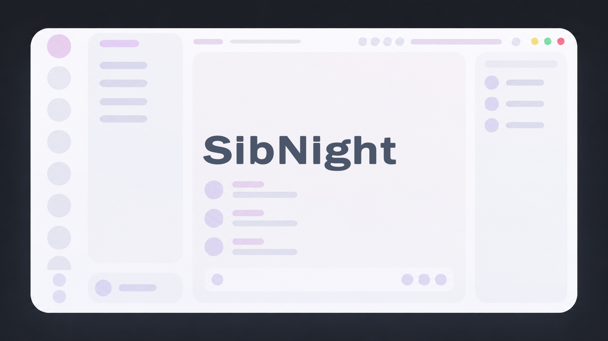

<p align="center">
  
</p>

<h1 align="center">sibnight</h1>

<p align="center">
  Un thème Discord sombre inspiré par l'identité visuelle de Sibylla.
</p>

<p align="center">
  
</p>

## Installation

### Installation via fichier

Pour **Vencord**, **BetterDiscord** ou tout autre client qui prend en charge les fichiers de thème :

1. Télécharge `themes/sibnight.theme.css`.
2. Place le fichier dans le dossier de thèmes de ton client Discord.
3. Active **sibnight** dans les paramètres de ton client.

### Installation via lien

Ajoute ce lien dans les imports de thème de ton client :

```text
https://ussmarines.github.io/DiscordTheme/themes/sibnight.theme.css
```

Pour personnaliser le thème, copie les variables du thème dans ton **QuickCSS**, puis modifie les valeurs depuis là.

## Flavors

Les flavors sont des variantes prédéfinies de **sibnight**. Chaque flavor est un fichier `.theme.css` autonome qui importe le socle partagé `build/sibnight-flavor.css`.

Pour utiliser une flavor, installe le fichier correspondant dans `themes/flavors/` à la place du thème principal.

<table>
  <tr>
    <td width="50%" align="center" valign="top">
      <a href="./themes/flavors/sibnight-flat.theme.css">
        
      </a>
      <br>
      <strong>sibnight-flat</strong>
      <br>
      <code>themes/flavors/sibnight-flat.theme.css</code>
    </td>
    <td width="50%" align="center" valign="top">
      <a href="./themes/flavors/sibnight-tokyo-night.theme.css">
        
      </a>
      <br>
      <strong>sibnight-tokyo-night</strong>
      <br>
      <code>themes/flavors/sibnight-tokyo-night.theme.css</code>
    </td>
  </tr>
  <tr>
    <td width="50%" align="center" valign="top">
      <a href="./themes/flavors/sibnight-sun.theme.css">
        
      </a>
      <br>
      <strong>sibnight-sun</strong>
      <br>
      <code>themes/flavors/sibnight-sun.theme.css</code>
    </td>
    <td width="50%" align="center" valign="top">
      <a href="./themes/flavors/sibnight-space.theme.css">
        
      </a>
      <br>
      <strong>sibnight-space</strong>
      <br>
      <code>themes/flavors/sibnight-space.theme.css</code>
    </td>
  </tr>
  <tr>
    <td width="50%" align="center" valign="top">
      <a href="./themes/flavors/sibnight-north-polar.theme.css">
        
      </a>
      <br>
      <strong>sibnight-north-polar</strong>
      <br>
      <code>themes/flavors/sibnight-north-polar.theme.css</code>
    </td>
    <td width="50%" align="center" valign="top">
      <a href="./themes/flavors/sibnight-north-snow.theme.css">
        
      </a>
      <br>
      <strong>sibnight-north-snow</strong>
      <br>
      <code>themes/flavors/sibnight-north-snow.theme.css</code>
    </td>
  </tr>
  <tr>
    <td width="50%" align="center" valign="top">
      <a href="./themes/flavors/sibnight-north-aurora-dark.theme.css">
        
      </a>
      <br>
      <strong>sibnight-north-aurora-dark</strong>
      <br>
      <code>themes/flavors/sibnight-north-aurora-dark.theme.css</code>
    </td>
    <td width="50%" align="center" valign="top">
      <a href="./themes/flavors/sibnight-north-aurora-light.theme.css">
        
      </a>
      <br>
      <strong>sibnight-north-aurora-light</strong>
      <br>
      <code>themes/flavors/sibnight-north-aurora-light.theme.css</code>
    </td>
  </tr>
</table>

## Liens d'import distants

```text
https://ussmarines.github.io/DiscordTheme/themes/sibnight.theme.css
https://ussmarines.github.io/DiscordTheme/themes/flavors/sibnight-flat.theme.css
https://ussmarines.github.io/DiscordTheme/themes/flavors/sibnight-tokyo-night.theme.css
https://ussmarines.github.io/DiscordTheme/themes/flavors/sibnight-sun.theme.css
https://ussmarines.github.io/DiscordTheme/themes/flavors/sibnight-space.theme.css
https://ussmarines.github.io/DiscordTheme/themes/flavors/sibnight-north-polar.theme.css
https://ussmarines.github.io/DiscordTheme/themes/flavors/sibnight-north-snow.theme.css
https://ussmarines.github.io/DiscordTheme/themes/flavors/sibnight-north-aurora-dark.theme.css
https://ussmarines.github.io/DiscordTheme/themes/flavors/sibnight-north-aurora-light.theme.css
```

## Développement

Le projet conserve deux fichiers CSS générés :

- `build/sibnight.css` pour le thème principal ;
- `build/sibnight-flavor.css` pour les flavors, avec leur socle commun mutualisé.

Commandes utiles :

```bash
npm run build
npm run check
npm run prepare:release
```

Utilise `npm run build` après une modification des sources CSS, puis `npm run check` avant publication. La commande `npm run prepare:release` exécute les deux étapes dans le bon ordre.

## Structure

- `themes/sibnight.theme.css` : fichier principal à installer.
- `themes/flavors/` : fichiers `.theme.css` des huit flavors existants.
- `src/` : modules CSS sources utilisés pour générer le build.
- `build/` : CSS généré et publié via GitHub Pages.
- `assets/readme/` : captures utilisées dans ce README.
- `scripts/` : scripts Node de build, dev et vérification.

## Crédits

- Design original inspiré de [Zelk](https://github.com/schnensch0/zelk).
- Conception du thème inspirée de [Midnight](https://github.com/refact0r/midnight-discord).
- Contrôles de fenêtre inspirés de [Tokyo Night](https://github.com/Dyzean/Tokyo-Night).

L'auteur principal de ce projet est **ussmarines**.
